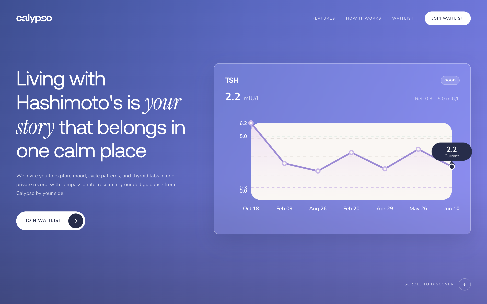

# Calypso Health — Website

Public marketing site and waitlist for [Calypso Health](https://calypsoai.health).



## Local preview

```bash
python3 -m http.server 8910
```

Open [http://localhost:8910](http://localhost:8910).

## Deploy (Vercel)

1. Import this repo in Vercel
2. Root directory: `.` (repo root)
3. No build command needed — static HTML/CSS/JS
4. Add custom domain `calypsoai.health`

## Waitlist

Signups go to Supabase table `waitlist_signups`. Config is in `config.js` (anon key + RLS insert-only).

## Fonts

Public site uses **DM Sans** (headings), **Instrument Serif** (emphasis), and **Nunito** (body) via Google Fonts.

Commercial trial fonts (Aeonik, Beatrice) are intentionally excluded — CoType/Beatrice trial licenses do not allow use on public websites or redistribution.
